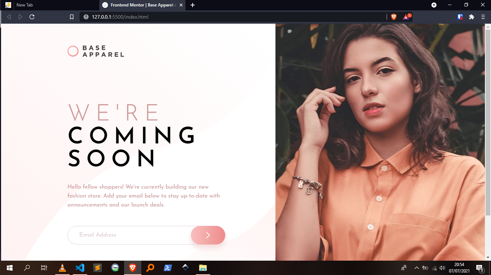
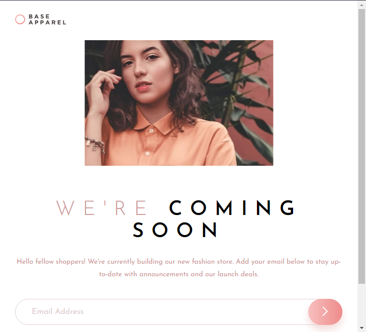
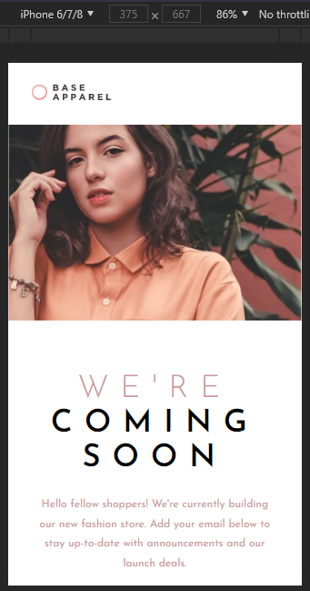

# Frontend Mentor - Base Apparel coming soon page solution

This is a solution to the [Base Apparel coming soon page challenge on Frontend Mentor](https://www.frontendmentor.io/challenges/base-apparel-coming-soon-page-5d46b47f8db8a7063f9331a0). Frontend Mentor challenges help you improve your coding skills by building realistic projects.

## Table of contents

-  [Overview](#overview)
   -  [The challenge](#the-challenge)
   -  [Screenshots](#screenshots)
   -  [Links](#links)
-  [My process](#my-process)
   -  [Built with](#built-with)
   -  [What I learned](#what-i-learned)
   -  [Continued development](#continued-development)
   -  [Useful resources](#useful-resources)
-  [Author](#author)

## Overview

### The challenge

Users should be able to:

-  View the optimal layout for the site depending on their device's screen size
-  See hover states for all interactive elements on the page
-  Receive an error message when the `form` is submitted if:
   -  The `input` field is empty
   -  The email address is not formatted correctly

### Screenshots

Screenshot of page on full-sized screens.

Screenshot of the page on medium-sized screens.

Screenshot of the page on small-sized screens.

### Links

-  Solution URL: [Challenge Solution](https://www.frontendmentor.io/solutions/desktopfirst-workflow-using-sass-guide-to-coding-challenges-included-Wj3J60OtM)
-  Live Site URL: [Base Apparel](https://allankirui.github.io/Base-Apparel)

## My process

### Built with

-  Semantic HTML5 markup
-  [SASS](https://sass-lang.com/) - Give your CSS superpowers
-  Desktop-first workflow
-  [Inkscape](https://inkscape.org) - Inkscape: Open Source Scalable Vector Graphics Editor

### What I learned

I continue to improve my coding skills by building such projects.

### Continued development

I want to focus on getting more comfortable with using SASS in future projects.

### Useful resources

-  [Inkscape](https://inkscape.org) - Inkscape SVG Editor. I use it all the time when I'm working on any web project. For this project, I loaded the project designs into Inkscape and used it's in-built tools to figure out the _spacing_, _sizing_ and _positioning_ of elements throughout the project.

-  To better understand how I approached coding the project using Inkscape, have a look at this repository I made - [Designing and Coding Layouts](https://github.com/AllanKirui/designing-and-coding-layouts)

## Author

-  Github - [@AllanKirui](https://www.github.com/AllanKirui)
-  Frontend Mentor - [@AllanKirui](https://www.frontendmentor.io/profile/AllanKirui)
-  Instagram - [@nallawilljr](https://www.instagram.com/nallawilljr)
